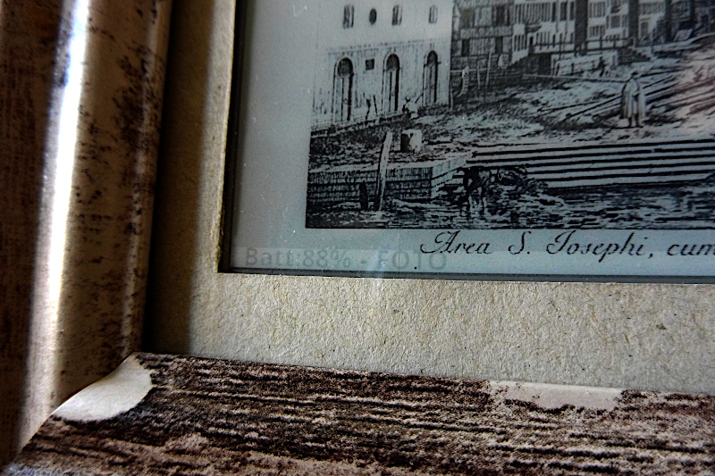

# EpdWebImage
Retrieve images from a Web server and display them on a LilyGo T5 4.7" e-paper display.

One image is reloaded and refreshed every 5 minutes. In the meantime, if no buttons are pressed, the ESP32 goes to deep sleep in order to reduce consumption.

Pressing the rightmost button on the rear of the screen (GPIO 39) switches to the next in a set of 4 images (easy to increment, if needed). This allows to have any kind of visuals prepared on the server with any method (for example, periodically screen scraping a website) and to choose between them.

Battery charge is displayed at every button press, together with the name of the next visualization. If the image has not changed, only this "footer" is refreshed, without flickering the whole display.
This leaves a slight "watermark" on the bottom of the screen where battery status can be read at all times.

Image modification is detected client-side, computing a checksum after it has been downloaded, with no special requirement on the server side. Not very efficient for bandwidth, but easy to host.

Pressing the leftmost button resets the ESP32, refreshing the display with the first image.

## Customization and Usage
Add to the sketch a header file named "secrets.h" where you #define `WIFI_SSID` and `WIFI_PWD` for your network.
Otherwise, write them in place of "************" inside the sketch

The string array `screenNames` contains the name of each of the 4 screens, displayed at every change.

Change the string `URL` to match the position of your images.

If you want a different delay between image refreshes, #define `TIME_TO_SLEEP` with the desired number of seconds.

If the "watermark" banner at the bottom is not desirable, you can modify the switch in the `loop()` function at the end, so that `edp_update()` is called in any case.

## Image format

For client simplicity, the images are expected to be resized and converted to a simple uncompressed format on the server: 960x540 PGM binary greyscale (8 bit).
You can convert any image using ImageMagick or GraphicsMagick tool "convert".

For example:

    `convert <FILENAME> -rotate "90<" -gravity center -resize 960x540 -extent 960x540 -colorspace Gray -sharpen 0x2 -gamma 1.33 -dither FloydSteinberg -colors 16 pgm:/var/www/html/images/epd_image_0.pgm`

Reducing the file to 16 grey levels with Floyd Steinberg dithering gives excellent results on the hi-dpi screen of the LilyGo, even for B&W high contrast photos.

## TODO

- Find a way to wake up the ESP32 with any of the four buttons (excluding "reset") and associate each with a single image, removing the need to (slowly!) cycle through all the images.
- Experiment with JPEG instead of PGM, using Bodmer library: https://github.com/Bodmer/TJpg_Decoder

# KNOWN ISSUES

Some PGM images are displayed with an offset to the right, as the code seems to slightly underestimate the length of the header.
